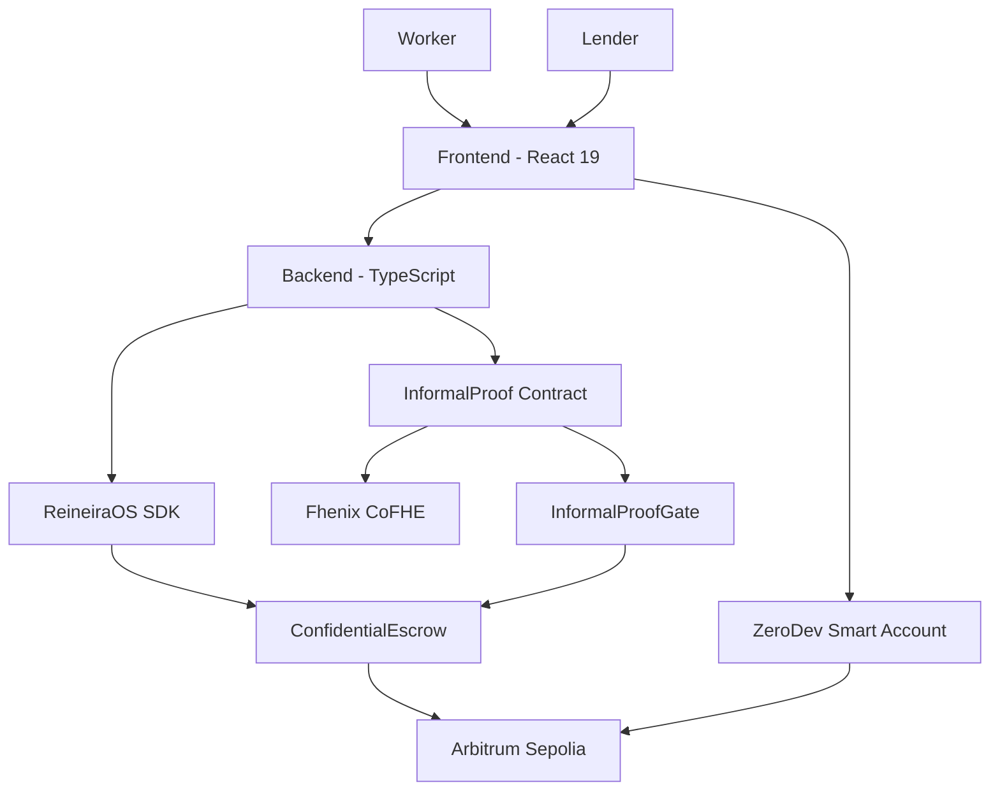

# Architecture — Lendi

## Ecosystem

| Repo / path            | Stack                        | Purpose                      |
| ---------------------- | ---------------------------- | ---------------------------- |
| lendi (this repo)      | pnpm monorepo                | Product app + backend        |
| dapp/ (Lendi repo)     | Hardhat + Solidity + cofhejs | InformalProof core contracts |
| reineira-atlas         | Markdown + Claude agents     | Startup OS                   |
| documentation/frontend | Next.js + RainbowKit         | Marketing site (not product) |

## Tech Stack

| Layer      | Technology                                                             | Purpose             |
| ---------- | ---------------------------------------------------------------------- | ------------------- |
| Contracts  | Solidity ^0.8.25 + Hardhat + cofhejs                                   | InformalProof, Gate |
| Frontend   | React 19 + TypeScript + Vite + Zustand + TanStack Router + TailwindCSS | Product app         |
| Backend    | TypeScript + Clean Architecture + Drizzle + Neon                       | API + orchestration |
| Wallet     | ZeroDev — ERC-4337 smart accounts, passkeys                            | User operations     |
| Encryption | Fhenix CoFHE                                                           | On-chain FHE        |
| Settlement | ReineiraOS ConfidentialEscrow + USDC                                   | Loan escrow         |
| Deploy     | Hardhat (contracts), Vercel (apps)                                     | Infrastructure      |

## System Diagram



## Data Entities

| Entity      | Description                           | Key Fields                                        |
| ----------- | ------------------------------------- | ------------------------------------------------- |
| Worker      | Informal worker with encrypted income | wallet, registration status, timestamps           |
| Lender      | Capital deployer with fee paid        | wallet, registration status, fee paid             |
| IncomeEvent | Off-chain income recording index      | worker id, tx hash, source, timestamp (no amount) |
| Loan        | Escrow-backed loan record             | escrow id, worker, lender, status (no amount)     |

## Running Locally

```bash
# Backend
cd packages/backend && pnpm dev

# Frontend
cd packages/app && pnpm dev  # port 4831

# Contracts (in separate dapp/ repo)
cd dapp && npx hardhat test
```
